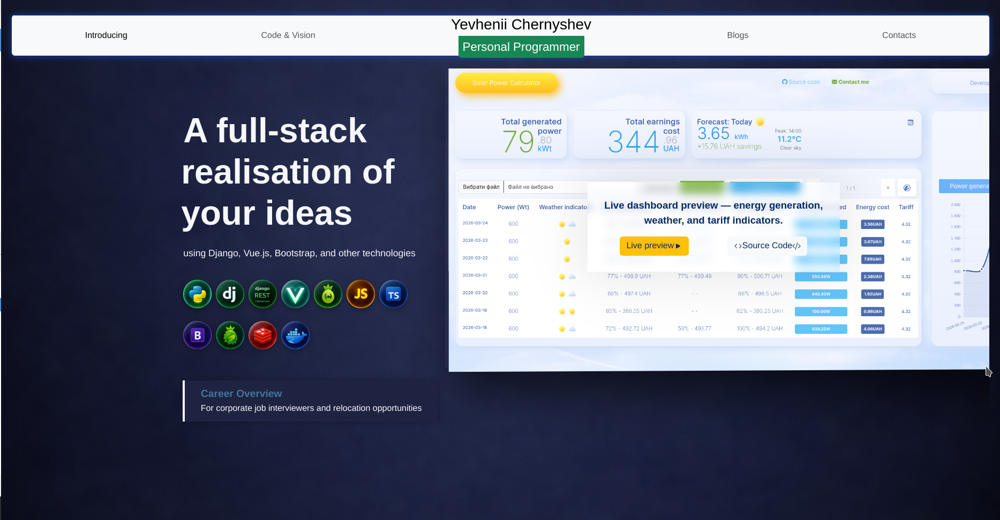
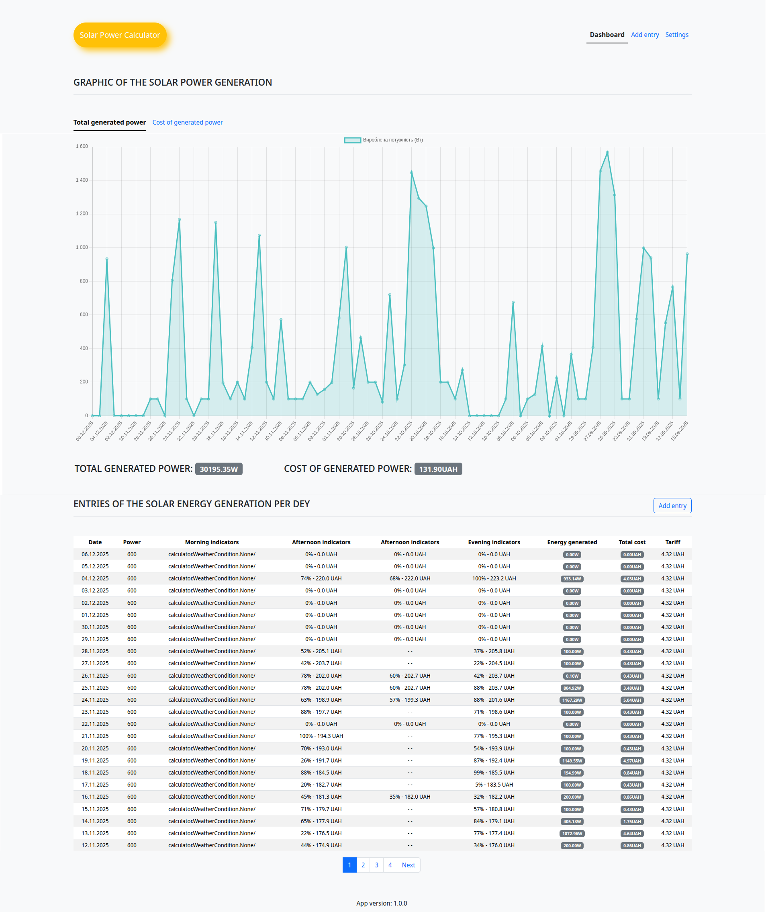

[Україномовна версія](README.uk-UA.md)

# 🚀 Personal Dev Showcase
[](https://opensource.org/licenses/MIT)
[](https://www.python.org/)
[](https://www.djangoproject.com/)
[](https://nodejs.org/)
[](https://vuejs.org/)

[//]: # ([![Build]&#40;https://github.com/ychernyshev/portfolio--personal-suite/actions/workflows/ci.yml/badge.svg&#41;]&#40;https://github.com/ychernyshev/portfolio--personal-suite/actions/workflows/ci.yml&#41;)


Welcome to my software projects `monorepository`. This space is designed to demonstrate my skills in `Full-stack development`, with a focus on clean code, architectural flexibility, and automation.

## 🧾 Table of Contents
-  [Project Structure](#-project-structure)
- [Tech Stack](#-tech-stack)
- [App List](#-app-list)
- [Backend Detailed](#-backend-detailed)
- [Frontend Detailed](#-frontend-detailed)
- [Apps Detailed](#-apps-detailed)
  - [Personal Page](#1--personal-page)
  - [Solar Power Calculator V1 Legacy](#2--solar-power-calculator-v1-legacy) 
  - [Solar Power Calculator V2 Active](#3--solar-power-calculator-v2-active)
- [Local Launching](#-local-launching)
- [Short API reference](#short-api-reference)
  - [Solar Power Calculator V2 API](#-solar-power-calculator-v2-api)
    - [Example Requests](#example-requests)
- [Docker Support](#-docker-support)
- [Current deployment](#-current-deployment)
- [Contact](#-contact)
- [License](#-license)

## 📂 [Project Structure](#-project-structure)

```
├── backend/                # Django Project (Python 3.12+)
│   ├── calculator/         # Solar app logic and API
│   ├── personal/           # Portfolio API & email service
│   └── settings/           # Security, CORS, CSRF & deployment config
├── frontend/               # Vue 3 Project (Vite + TypeScript)
│   ├── src/
│   │   ├── components/
│   │   │   ├── calculator/ # Dashboard, charts, and table components
│   │   │   └── personal/   # Hero section, Timeline, and contact components
│   │   ├── store/          # Pinia (state management for messages and data)
│   │   └── assets/         # Styles (CSS), icons, and images
└── README.md               # Global documentation
```

## 🛠 [Tech Stack](#-tech-stack)

| Domain               | Technologies                                                          |
|:---------------------|:----------------------------------------------------------------------|
| **Backend**          | Python 3.12, Django 5.2.7, Django REST Framework, Pandas, NumPy       |
| **Frontend**         | Node 20, Vue 3 (Composition API), TypeScript, Pinia, Vite, Vue Router |
| **DevOps & Tooling** | Vercel, Render (PaaS), Gunicorn, CORS/CSRF Security, Yarn             |
| **Database**         | PostgreSQL / SQLite                                                   |
| **Visualization**    | Chart.js                                                              |
| **Styling**          | Bootstrap 5, Bootswatch, FontAwesome                                  |
| **API/Data**         | Open-Meteo API, Axios, Excel/CSV Export/Import                        |

## 📱 [App List](#-app-list)
- Personal Page
- [Solar Power Calculator V1 Legacy](https://github.com/ychernyshev/portfolio--personal-suite/blob/v1-legacy/README.md)
- [Solar Power Calculator V2 Active](https://github.com/ychernyshev/portfolio--personal-suite/blob/v2-reborn-in-vue/frontend/README.md)

## ⚙️ [Backend Detailed](#-backend-detailed)
### Main responsibilities
- 🔌 **REST API**Built with DRF, supporting full CRUD for solar records.
- 📈 **Data Processing & Aggregations** 
  - **`Current` and `real-time` aggregations**:
    - For sunny days count, average temperature, monthly average power, monthly total power, percentage performance comparison current vs previous month with NaN handling, etc.
  - **Planned feature**: 
    - Pandas and NumPy.
- 📑 **Reporting**: Endpoints for automated `CSV/Excel` data lifecycle.

## 🎨 [Frontend Detailed](#-frontend-detailed)
### Main responsibilities
- Responsive dashboard from **320px** upward.
- Components: `MonthStats.vue`, `Dashboard.vue`, `TopNav`, `WeatherIcon`, `RecordsTable`, `AddRecord`, `Settings`, `CodeAndVision`, `Personal pages`, `Calculator` app.
- Charts: power generation, cost savings; drill‑down modal with tables and charts.
- State: Pinia stores (`useNotificationStore`, etc.).
- Routing: modular routes with lazy loading and layout-based rendering.

### Notes
- Env variables must be prefixed with `VITE_` (e.g., `VITE_API_URL`).
- Assets: Bootstrap core, Bootswatch, FontAwesome, custom CSS (`personal.css`, `calculator.css`).
- `Axios` configured for API calls; calculator/ prefix used for calculator app endpoints.

## 🚀 [Apps Detailed](#-apps-detailed)
### 1. 🏠 [Personal Page](#1--personal-page)
The central hub of my portfolio.

#### Desktop view


#### Mobile view


*   **Purpose:** Presentation of experience, technical stack, and communication tools.
*   **Latest Updates:** 
    *   Implemented an animated `WakeUpLoader` to mitigate the "cold start" effect on free PaaS platforms like `Render` or `Vercel`.
    *   The contact form has been moved to a separate `useContactForm` service for better code maintainability.

### 2. 🏛️ [Solar Power Calculator V1 Legacy](#2--solar-power-calculator-v1-legacy)
A previous version of the `Calculator` in the form of a notebook with a simple design and logic

#### Desktop View


An analytical platform for monitoring and calculating the efficiency of solar power plants. Based on the initial monolithic iteration of the system, built with a focus on robust backend logic and `Server-Side Rendering (SSR)`.
- **Monolithic Architecture**: Built entirely within the Django ecosystem using `Django Templates `and `Django Forms`, with business logic encapsulated in a dedicated service layer (`handle_entry_form.py`).
- **Automated Financial Logic**: Implemented math algorithms for real-time calculation of generated power (Watts) and financial savings, including automated battery discharge compensation and precision rounding (2 decimal places).
- **Integrated Management**: Features a built-in `Add Entry` system with automated validation and a customized `Django Admin` interface for advanced record management.
- **Server-Side Dashboard**: `Desktop-oriented UI` using `Bootstrap`, featuring a tabbed interface for `Chart.js` visualizations (power generation vs. costs) and paginated data tables.
- **Data Integrity**: Specialized handling for missing "afternoon" data points and battery-level logic to ensure accurate accounting of net energy production.

### 3. ☀️ [Solar Power Calculator V2 Active](#3--solar-power-calculator-v2-active)
The second iteration of the `Calculator APP` was developed as a service with a responsive design,  a reactive template, friendlу user UI experience, and extended functionality

#### Desktop View


#### Mobile View


An analytical platform for monitoring and calculating the efficiency of solar power plants.
*   **Purpose:** Data collection on generation, financial accounting, and performance analytics.
*   **Key Features:**
*   **Dashboard:** The `MonthStats` widget, which compares current generation with the previous month in real-time using percentages.
*   Implemented a pinned notification system (`MessagesStack`) with icons for event types: success, info, warning, and errors
*   **Smart Table:** A record table with intelligent status badges (`NOT TRACKED`, `NO GENERATION`) and context-aware color indication.
*   **Backend Analytics:** Calculation of sunny days, average temperatures, total power, and generated energy costs on the Django side using model methods.


## 💻 [Local Launching](#-local-launching)
### Backend
```bash
    cd backend
    python -m venv venv
    source venv/bin/activate  # or venv\Scripts\activate for Windows
    pip install -r requirements.txt
    python manage.py migrate
    python manage.py runserver
```

### Frontend
```bash
    cd frontend
    yarn install
    yarn dev --host 0.0.0.0 --port 5173
```

## [Short API reference](#short-api-reference)
Use a compact table for endpoints and short `curl` examples + a minimal sample response. Put full response examples in code blocks.

## 📡 [Solar Power Calculator V2 API](#-solar-power-calculator-v2-api)

| Method | Endpoint | Purpose | Notes                                                                                                            |
|--------|----------|---------|------------------------------------------------------------------------------------------------------------------|
| GET    | /api/calculator/entries/ | List all records | Supports pagination                                                                                              |
| GET    | /api/calculator/weather-conditions/ | Weather data | Cached hourly forecast                                                                                           |
| GET    | /api/calculator/current-tariff/ | Current tariff | Returns UAH per kWh and sets a new one                                                                           |
| GET    | /api/calculator/stats/ | Monthly stats | Count of sunny days, avg temp, avg power,  total power, current savings, month-over-month performance comparison |
| GET    | /api/calculator/forecast/ | Daily forecast | kWh, savings, peak hour                                                                                          |
| GET    | /api/calculator/forecast/details/ | Hourly forecast | Temperature, sky condition                                                                                       |
| GET    | /api/calculator/data-export/ | Export records | Excel download                                                                                                   |
| POST   | /api/calculator/data-import/ | Import records | CSV upload                                                                                                       |

#### [Example Requests](#example-requests)
```bash
# Get current monthly stats
curl -s https://api.example.com/api/calculator/stats/

# Import CSV
curl -X POST https://api.example.com/api/calculator/data-import/ \
  -F "file=@records.csv"
```

## 🐳 [Docker Support](#-docker-support)
#### Planned features
- `docker-compose up` started backend (`Gunicorn`) + frontend (`Nginx`) + `PostgreSQL
- `Redis` + `Celery` (planned for `Post Flow Controlling App`)


## 🌐 [Current deployment](#-current-deployment)
- **Frontend**: `Vercel` (auto-deploy from repository)
- **Backend**: `Render` (`Gunicorn` + `PostgreSQL`, auto-deploy from repository)
- **Domain**: `ychernyshev.vercel.app`

## 📫 [Contact](#-contact)
Feel free to reach out via the contact form on my [Personal Page](https://ychernyshev.vercel.app/) or via [LinkedIn](https://www.linkedin.com/in/ychernyshev/).

## 📜 [License](#-license)
[MIT License](LICENSE) — free to use, modify, and distribute.