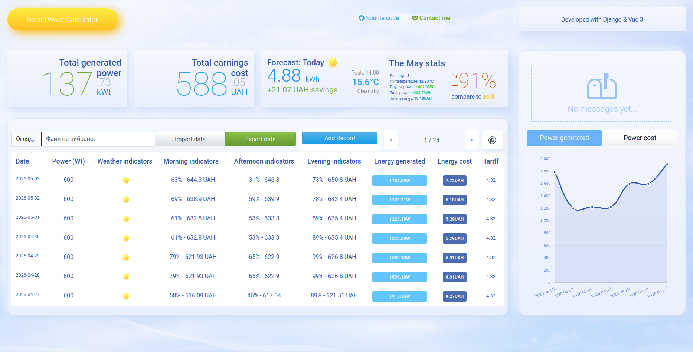
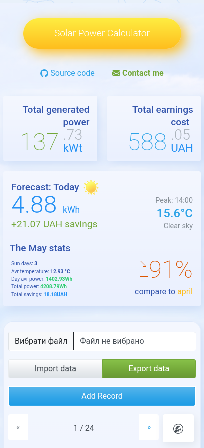
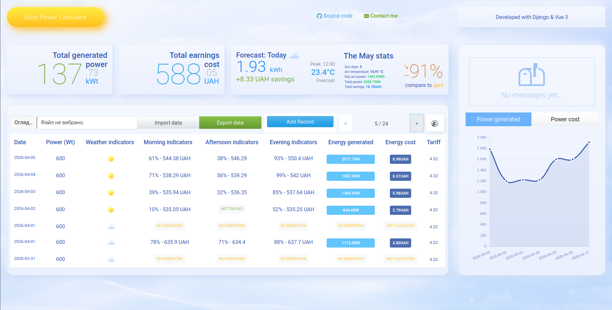
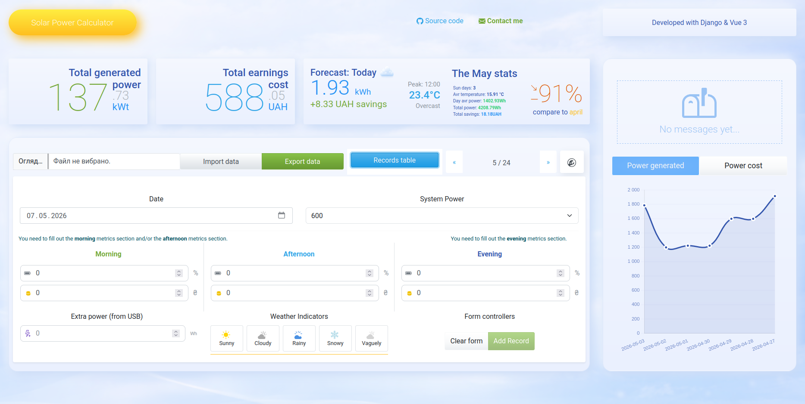
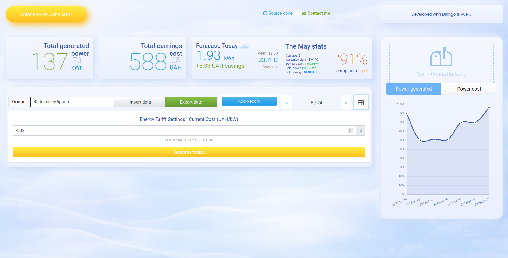
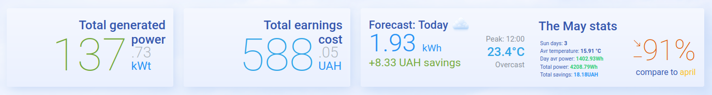

[](https://github.com/ychernyshev/portfolio--personal-suite/blob/v1-legacy/README.md) [](README.personal.page.md)

# ☀️ Solar Power Calculator V2
[](https://opensource.org/licenses/MIT)
[](https://www.python.org/)
[](https://www.djangoproject.com/)
[](https://nodejs.org/)
[](https://vuejs.org/)

An evolutionary analytical platform for monitoring and calculating the efficiency of solar power plants. This project demonstrates a transition from a classic **Django SSR** (Server-Side Rendering) monolith to a modern **Django + DRF (backend)** and **Vue 3 + TypeScript (frontend)**.

## 🧾 Table of Contents
- [Project Structure](#-project-structure)
- [Tech Stack](#-tech-stack)
- [Key Features](#-key-features)
  - [Analytics & Dashboard](#-analytics--dashboard)
  - [Weather Integration](#-weather-integration)
  - [Technical Specifications](#-technical-specifications)
  - [Architecture (Monorepo)](#-architecture-monorepo)
  - [Local Setup](#-local-setup)
  - [Backend Features](#-backend-features)
  - [Frontend Features](#-frontend-features)
- [API Reference](#-api-reference)
  - [Example Requests](#example-requests)
- [Screenshots](#-screenshots)
  - [Dashboard view](#dashboard-view)
    - [Desktop](#desktop)
    - [Mobile](#mobile)
  - [Records table with badges](#records-table-with-badges)
  - [Add record](#add-record)
  - [Tariff settings](#tariff-settings)
  - [Widgets](#widgets)
- [Roadmap](#-roadmap)
- [License](#-license)

## 📂 Project Structure
```
├── frontend/src/assets/calculator           # Styles, images, scripts
├── backend/calculator/                      # Django app for solar logic & API
├── frontend/src/components/calculator       # Vue components (Dashboard, MonthStats, RecordsTable, WeatherIcon)
├── frontend/src/router/CalculatorRoutes.ts  # The project routes collection module
├── frontend/src/services/calculator         # Reusing code in separated files (backend API address, import/export data, weather API, etc.)
├── frontend/src/store/useCalculatorStore.js # Pinia stores (notifications, weather, records)
```

## 🛠 Tech Stack
- **Backend**: Python 3.12, Django 5.2.7, DRF, Pandas, NumPy
- **Frontend**: Vue 3 (Composition API), TypeScript, Pinia, Vite, Vue Router
- **Database**: PostgreSQL / SQLite
- **Visualization**: Chart.js
- **Styling**: Bootstrap 5, Bootswatch, FontAwesome
- **API/Data**: Open-Meteo API, Axios
- **DevOps**: Render (backend), Vercel (frontend)

## 🚀 Key Features
### 📊 Analytics & Dashboard
- **Reactive Monitoring**: The `MonthStats` widget compares current generation with the previous month in real-time, calculating the performance difference in percentages.
- **Data Visualization**: Interactive charts for power generation and cost savings, built using `Chart.js`.
- **Smart Records Table**: A responsive table featuring pagination and intelligent status badges (`NOT TRACKED`, `NO GENERATION`, and `NOT CALCULATED`) that adapt based on the data context.
- **Financial Accounting**: Automatic calculation of savings in UAH based on dynamically adjustable electricity tariffs.

### ☁️ Weather Integration
- **Weather API**: A custom DRF implementation that fetches and caches meteorological data from the `Open-Meteo API`.  
- **Forecasting**: Calculates tomorrow's generation forecast, including expected power output, financial savings, and peak sun hours.  
- **Visual Widgets**: Customized weather icons with transitional animation effects and an integrated calendar for historical data navigation.

### 🛠 Technical Specifications
- `Backend (Django 5.x)`: Utilizes `Pandas` and `NumPy` for complex data processing and hourly weather analysis.  
- `Frontend (Vue 3 + TS)`: Powered by `Pinia` for state management (notifications, weather data, UI states) and `Vue Router` for modular navigation.  
- `Data Lifecycle`: Features functionality for exporting records to `Excel` and importing from CSV files to ensure data stability and control.  
- `UX/UI Design`: Fully responsive layout (optimized for 320px to 1400px+), a custom `MessagesStack` notification system, and a `WakeUpLoader` to handle "cold starts" on PaaS platforms.  

### 🏗 Architecture (Monorepo)
The project is organized as a monorepository to ensure development integrity: 
- /backend: The Django-powered core serving APIs for both the calculator and the personal portfolio page.  
- /frontend: A Vue 3 SPA where the calculator and portfolio logic are separated at the component, store, and route levels.  

### 🔧 Local Setup
- **Environment**: Set up the `.env` file for Vite and Django to manage API keys and backend URLs.  
- **Backend**: Run migrations and `python manage.py runserver`.  
- **Frontend**: Execute `yarn install` and `yarn dev` to launch the development server.

### ⚙️ Backend Features
- REST API for records, weather, monthly stats, import/export
- Aggregations:
  - Sunny days count
  - Average temperature
  - Monthly average power
  - Monthly total power
  - Percentage difference vs previous month
- Endpoints for CSV import & Excel export
- Forecast API (daily & hourly)

### 🎨 Frontend Features
- Responsive dashboard (≥320px)
- Components:
  - `MonthStats.vue` — compare current vs previous month
  - `Dashboard.vue` — charts & tables
  - `RecordsTable.vue` — smart table with badges
  - `WeatherIcon.vue` — dynamic weather icons
  - `AddRecord.vue` — form with validation
- Charts: power generation, cost savings
- Notifications: pinned stack with success/info/warning/error
- State management: Pinia stores
- Responsive design for all breakpoints (320px → 1400px+)

## 📡 API Reference
| Method | Endpoint | Purpose |
|--------|----------|---------|
| GET    | /api/calculator/entries/ | List all records |
| GET    | /api/calculator/weather-conditions/ | Weather data |
| GET    | /api/calculator/current-tariff/ | Current tariff |
| GET    | /api/calculator/stats/ | Monthly stats |
| GET    | /api/calculator/forecast/ | Daily forecast |
| GET    | /api/calculator/forecast/details/ | Hourly forecast |
| GET    | /api/calculator/data-export/ | Export records |
| POST   | /api/calculator/data-import/ | Import records |

### Example Requests
```bash
# Get current monthly stats
curl -s https://api.example.com/api/calculator/stats/

# Import CSV
curl -X POST https://api.example.com/api/calculator/data-import/ \
  -F "file=@records.csv"
  
# Create a new record
curl -X POST https://api.example.com/api/calculator/entries/ \
  -H "Content-Type: application/json" \
  -d '{
    "date": "2026-05-07",
    "power": 600,
    "weather": "sunny, rainy",
    "morning_data_charge": 63,
    "morning_data_price": 644.3,
    "afternoon_data_charge": 31,
    "afternoon_data_price": 646.8,
    "evening_data_charge": 73,
    "evening_data_price": 650.8,
  }'

```

## 📸 Screenshots
### Dashboard view
#### Desktop



#### Mobile



#### Records table with badges



#### Add record



#### Tariff settings



#### Widgets



## 📈 Roadmap
- Full Dockerization of the project using `docker-compose` (Gunicorn, Nginx, and PostgreSQL).  
- Integration of Redis and Celery for background task processing.

## 📜 License
[MIT License](../LICENSE) — free to use, modify, and distribute.