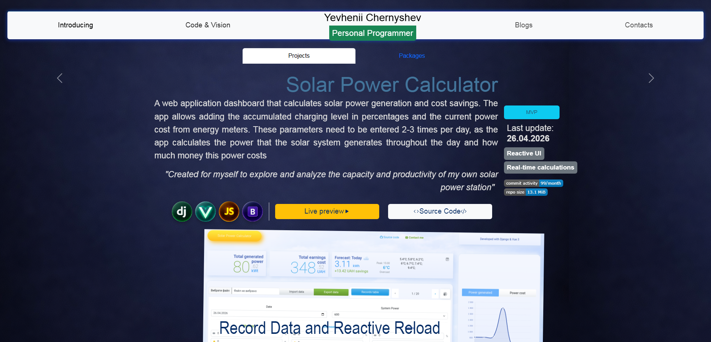
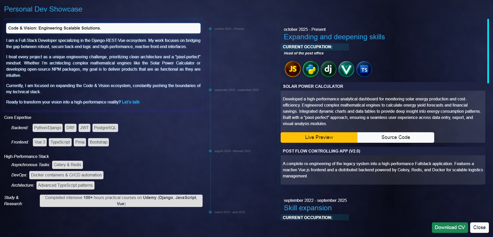
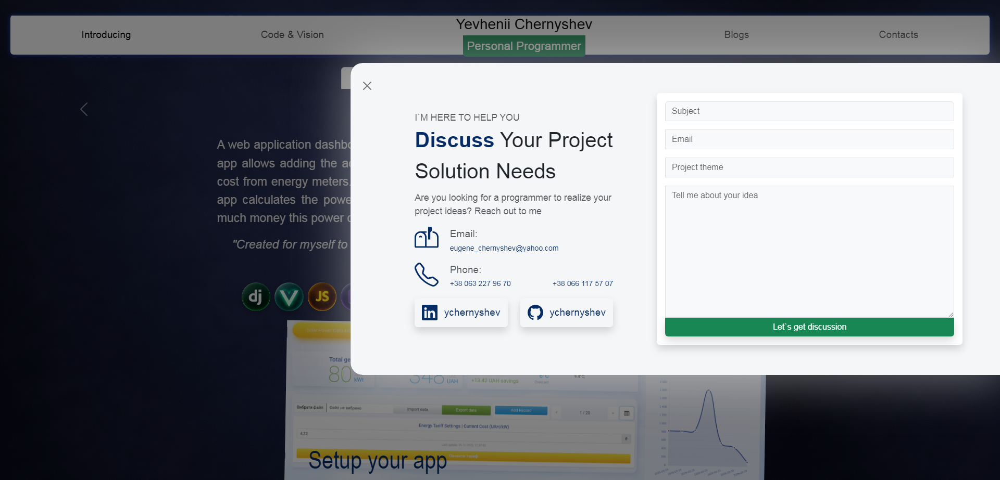

[](https://github.com/ychernyshev/portfolio--personal-suite/blob/v1-legacy/README.md)
[](README.personal.page.md)

# 🏠 Personal Page / Showcase
[](../LICENSE)
[](https://vuejs.org/)
[](https://www.typescriptlang.org/)
[](https://www.djangoproject.com/)


An interactive portfolio site designed to present experience, technical stack, and communication tools.  
Built with **Vue 3 + TypeScript (frontend)** and **Django (backend API)**.


## 🧾 Table of Contents
- [Project Structure](#-project-structure)
- [Tech Stack](#-tech-stack)
- [Key Features](#-key-features)
  - [Hero Section](#-hero-section)
  - [Navigation](#-navigation)
  - [Code & Vision](#-code--vision)
  - [Career Overview](#-career-overview)
  - [Contact Form](#-contact-form)
- [Screenshots](#-screenshots)
- [Deployment](#-deployment)
- [License](#-license)


## 📂 Project Structure
```
├── backend/personal/                   # Django app for portfolio API & email service
├── frontend/src/components/personal    # Vue components (HeroSection, TopNav, CodeAndVision, CareerOverview, ContactForm)
├── frontend/src/assets/personal        # Styles (personal.css), icons, images
└── docs/screenshots/personal_page      # Screenshots & documentation
```

## 🛠 Tech Stack
- **Frontend**: Vue 3 (Composition API), TypeScript, Vite, Vue Router, Pinia  
- **Backend**: Django 5.2.7, Django REST Framework  
- **Styling**: Bootstrap 5, Bootswatch, FontAwesome, custom CSS (personal.css)  
- **Features**: Axios, GitHub API integration, Email service (via Django backend)  
- **Deployment**: Vercel (frontend), Render (backend)  


## 🚀 Key Features
### 🎨 Hero Section
- Animated background and transition effects  
- Responsive design for desktop and mobile  

### 🧭 Navigation
- TopNav with routes to Intro, Code & Vision, Blogs, Contact  
- Mobile‑friendly design with icons and offcanvas menu  

### 💻 Code & Vision
- **ImageSlider** for project previews  
- Tabs for **Projects** and **Packages**  
- GitHub repository statistics integration  

### 📈 Career Overview
- Timeline of positions, skills, and badges  
- Responsive design for multiple breakpoints  

### 📬 Contact Form
- Offcanvas modal integrated with backend email service  
- Validation and styling for comfortable feedback sending  


## 📸 Screenshots
Hero Section  
#### Desktop

#### Mobile

#### Code & Vision page with ImageSlider  

#### Career Overview timeline  

#### Contact Form modal  



## 🌐 Deployment
- Frontend: Vercel (auto‑deploy from repository)  
- Backend: Render (Gunicorn + PostgreSQL, auto‑deploy from repository)  
- Domain: ychernyshev.vercel.app  


## 📜 License
[MIT License](../LICENSE) — free to use, modify, and distribute.
